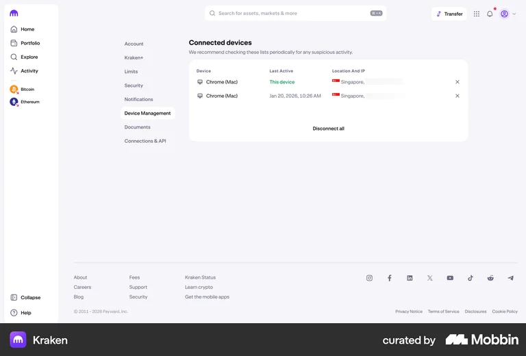
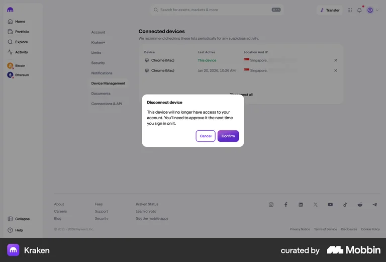
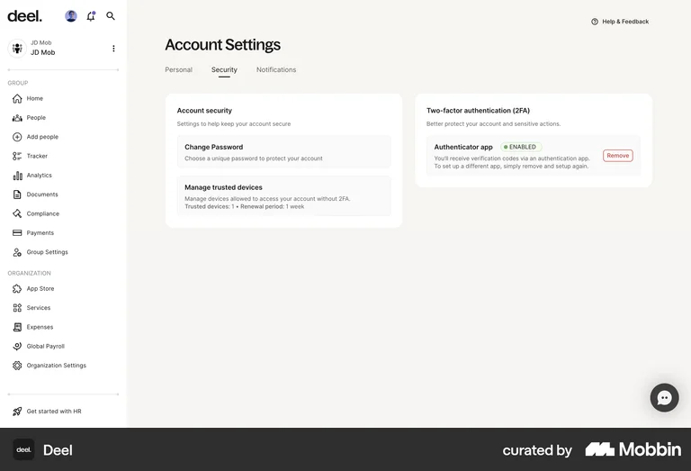

# Full application UI

Scope agreed on 2026-09-06: expose the existing application use cases through the options page, with popup quick access and a living component and screen gallery. Use the committed Mira, mauve, violet, Figtree and Hugeicons design system. No new framework or dependency is needed.

## Implementation sequence

1. Preserve the implemented entry workspace from the four saved workspace batches. Their read contracts, components, options integration and popup integration already exist in this checkout; leave the stashes intact.
2. Add stable options navigation for Entries, Tags, Password tools, Devices, Sync and Settings. Keep first setup and recovery focused on their required sequence. Keep secrets out of navigation identifiers and persistent UI state.
3. Connect device enrollment and trust management, vault security settings and the remaining sync management actions to composed core use cases. Feature controllers render outcomes; core remains responsible for trust, cryptography and persistence.
4. Register actual feature implementations and their behavior states in the component and screen galleries. Keep fixtures outside the production extension.
5. Validate application behavior, interruption and failure handling, then inspect both themes and narrow layouts in the browser. Load the built unpacked extension for runtime validation.

## Use-case coverage

| Core operations                                                                                     | User flow                                                                                         | Integration boundary                                                                                                                                                                 |
| --------------------------------------------------------------------------------------------------- | ------------------------------------------------------------------------------------------------- | ------------------------------------------------------------------------------------------------------------------------------------------------------------------------------------ |
| ListLocalVaults, GetVaultSessionStatus, UnlockVault, LockVault                                      | Select a local vault, unlock, lock and return to the selected vault                               | Existing setup/session capabilities; locking removes mounted secret forms                                                                                                            |
| InitializeVault                                                                                     | New vault, password, device preferences, save recovery record, verify three words                 | Existing setup controller                                                                                                                                                            |
| RecoverDeviceAccess                                                                                 | Forgot password, paste recovery words, choose password, save replacement words                    | Existing local recovery flow; numbered PDF paste accepted                                                                                                                            |
| ChangeMasterPassword                                                                                | Settings, change this device's password                                                           | Settings capability calls core; password fields are transient                                                                                                                        |
| ReplaceRecoveryWords, CopyRecoveryWords                                                             | Settings, replace and save recovery record, verify three random words                             | Shared setup recovery controller, guarded copy and export                                                                                                                            |
| DeleteLocalVault                                                                                    | Settings, remove the named local vault                                                            | Explicit confirmation; no claim that cloud data or other devices are removed                                                                                                         |
| ReadVaultWorkspace, ReadEntry, ReadEntryForEditing                                                  | Entries list, details and editor                                                                  | Password-free list and detail contracts; secret read only for deliberate editing/reveal                                                                                              |
| GetEntryPassword                                                                                    | Deliberate password access                                                                        | The existing reveal flow uses ReadEntryForEditing to keep its displayed entry revision current; no separate duplicate screen is needed                                               |
| SearchEntries                                                                                       | Find entries by login, website and tags                                                           | Existing table filters the password-free workspace result by login, website and tag text; no second search form                                                                      |
| AddEntry, UpdateEntry, RemoveEntry                                                                  | Add, edit, delete entries                                                                         | Existing revision-aware workspace; pending upload stays visible                                                                                                                      |
| CopyEntryPassword, ClearClipboardTask                                                               | Copy an entry password and clear the owned clipboard value                                        | Existing core copy operation and background cleanup; no standalone cleanup button                                                                                                    |
| GeneratePassword, GenerateUsername, CheckPasswordStrength                                           | Password tools and entry editor                                                                   | Shared generator controls; core supplies randomness, validation and scoring                                                                                                          |
| ReadTags, AddTag, UpdateTag, RemoveTag                                                              | Create, group, recolor, rename and remove vault tags                                              | Stable string IDs and causal versions are encrypted with the vault; duplicate names and stale edits are rejected, and referenced tags cannot be removed                              |
| ReadTagGroups, ReadFolders, AddFolder, UpdateFolder, MoveFolder, RemoveFolder                       | Choose one folder per entry and manage a nested folder tree                                       | Folder and group metadata are encrypted with the vault; cycles are rejected, Uncategorized is permanent and nonempty folders cannot be removed                                       |
| Popup workspace                                                                                     | Search, inspect and manage entries or generate credentials without leaving the popup              | Uses the same entry and generator capabilities as Options; unfinished drafts block navigation, while configuration actions explicitly open Options                                   |
| CreateDeviceEnrollmentRequest                                                                       | New device enters the trusted vault identity and creates an access request                        | Serialized artifacts through the existing transfer adapter; request keys remain protected locally                                                                                    |
| InitializeDeviceEnrollment                                                                          | Trusted device compares the complete request fingerprint and approves                             | Core verifies request and creates approval; UI shows the affected device                                                                                                             |
| PerformDeviceEnrollment                                                                             | New device imports its matching approval and saves recovery words                                 | Core verifies and activates the local vault using the original request password                                                                                                      |
| PrepareDeviceEnrollmentConsumption, ConsumeDeviceEnrollment                                         | Existing devices accept changed trust through Sync                                                | Core validates the remote snapshot and current trust state                                                                                                                           |
| RevokeDevice                                                                                        | Devices, review and revoke another device                                                         | Explicit consequences; cannot erase a device's existing plaintext or backups                                                                                                         |
| PrepareDeviceRevocationConsumption, ConsumeDeviceRevocation                                         | Sync receives a device removal                                                                    | Review and apply the core trust transition                                                                                                                                           |
| GetSyncConfiguration, TestSyncAccess, SetupSync, PrepareExistingSyncConnection, ConnectExistingSync | Set up S3 storage, permit browser access, test, enable or reconnect to a newer authenticated copy | Existing interactive guide and credential form; a read test does not claim upload success, setup never overwrites an existing object and reconnect requires a second explicit action |
| PrepareSyncReview, ApplySyncResolution, SyncUpload                                                  | Check sync, review changes, apply choices and retry pending upload                                | Existing guarded sync workflow                                                                                                                                                       |
| UpdateSyncCredentials                                                                               | Sync, replace this device's S3 keys                                                               | Scoped credentials stay device-local and encrypted                                                                                                                                   |
| DisableSync, CompleteProviderCredentialRevocation                                                   | Sync, review shutdown and finish provider-key removal                                             | Core tracks pending cleanup; UI distinguishes AWS actions from locally completed work                                                                                                |

Device-local naming and lock duration use the existing browser preference boundary. Do not add a parallel vault domain model for presentation. A minimal password-free device-management read contract can expose device identity and trust summaries needed by the Devices page.

## Reference review

Retrieved through Mobbin MCP and visually inspected on 2026-09-06. These are interaction references, not sources for LFSPM's security claims. The local images keep the reviewed screens available alongside the plan.

- [Kraken: disconnecting a device](https://mobbin.com/flows/06b47c28-24c4-47a4-ac6e-423ea47268f2). Reuse the identifiable current device, readable device list and separate confirmation of a destructive action. Do not copy location/IP fields that our application does not collect.
- [Deel: managing trusted devices](https://mobbin.com/flows/f2bc0f29-2d65-47a5-84d6-ee947617be53). Reuse grouped security settings and direct actions. Preserve our typography, colors and lack of heading subtitles.

## Required validation

- [x] Build, lint, type checks and gallery inventory pass.
- [x] Feature tests cover real outcomes, denied actions and stale async completions.
- [x] Generated password and username can become a new entry without URL or persistent draft storage.
- [x] Two-device enrollment, approval and trust updates work with real composed operations.
- [x] Settings clear secret inputs after success, locking or session invalidation.
- [x] Sync shutdown and provider cleanup stay actionable when a remote operation fails.
- [x] Actual screen implementations render in the gallery with named behavior states.
- [x] Browser review covers desktop, narrow layouts, dark/light themes and unpacked Chrome.

Browser capture and Fill runtime integration remain separate work. Their display contracts and optional popup views are available for gallery review. A Firefox package, external favicon fetching, whole-vault import formats and another sync provider remain outside this scope. Folder organization, grouped tags, local global-library suggestions and editable onboarding archetypes are implemented through explicit application contracts.

## Validation result

Validated again on 2026-09-07. The full suites passed with 630 extension tests and 833
core tests. Extension build, extension lint, core type check and the gallery
inventory passed, with 321 components/parts and 82 named variant axes registered.

`docs/ui-ux/verification/device-enrollment.verify.cjs` completed enrollment through
two separate unpacked Chrome profiles using real local persistence and crypto,
then read an existing entry on the new device. This browser test uses local
vaults; it does not claim a live two-device AWS account test.

`docs/ui-ux/verification/sync-options.verify.cjs` uses the actual AWS SDK with
intercepted S3 responses. It passed host permission, credential repair, recovery,
password/username generation into entries, device preference saving, password
change, recovery replacement and local deletion. Local deletion returned to setup
choices and left the intercepted remote vault unchanged. Both browser verifiers
collected page errors, console warnings and CDP logs without failures.

The gallery review covers the application, tools, devices, settings, device sync,
S3 sync and enrollment in light/dark themes at wide and narrow widths. Per-run
screenshots and raw output remain under ignored `.local/` storage. Browser checks
used Chrome 152; Firefox packaging and native printer behavior are outside this
pass.

## Review follow-up

Device enrollment and revocation request browser permission using only the storage location. Device file replacement clears any prior approval or fingerprint confirmation before reading and blocks submission while reading. Committed device actions retain their result and next security step if refreshing the device list fails. The gallery includes that failure scenario. Devices refresh on focus and same-session changes; session replacement still clears transient artifacts and credentials. Canceling revocation resets secret visibility.

Sync also preserves committed results when a subsequent status read fails. Successful refreshes clear obsolete refresh errors. Leaving enrollment or hiding its sync fields resets secret visibility, and Devices displays this browser's saved local name. The test review removed one redundant mock-forwarding test, extended existing behavior checks and added three focused boundary regressions (net two additional tests). See the [full application review](../review/full-application-ui.md) for coverage and validation limits.
