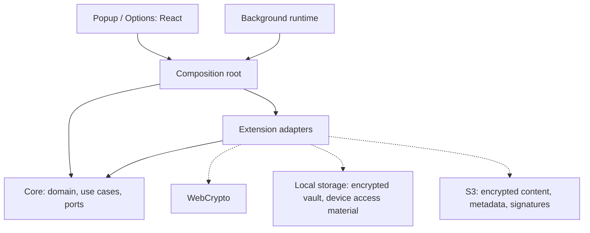
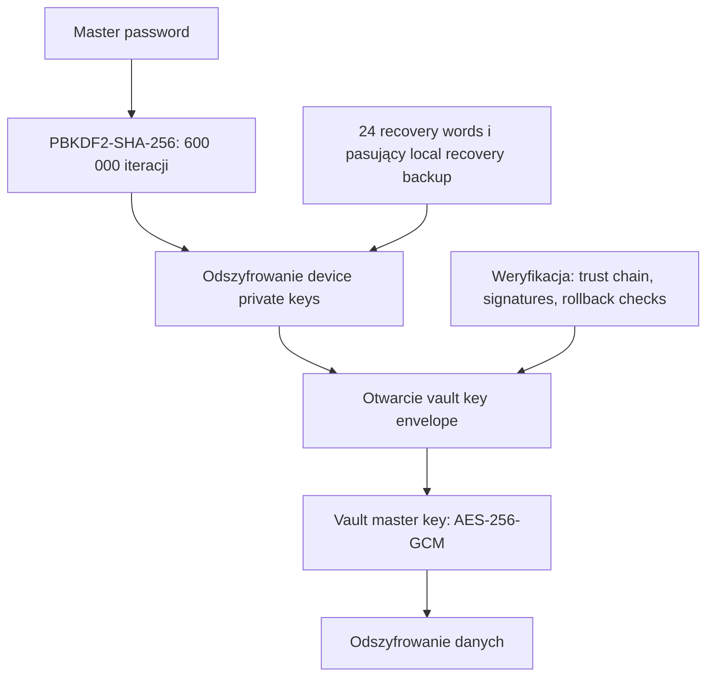
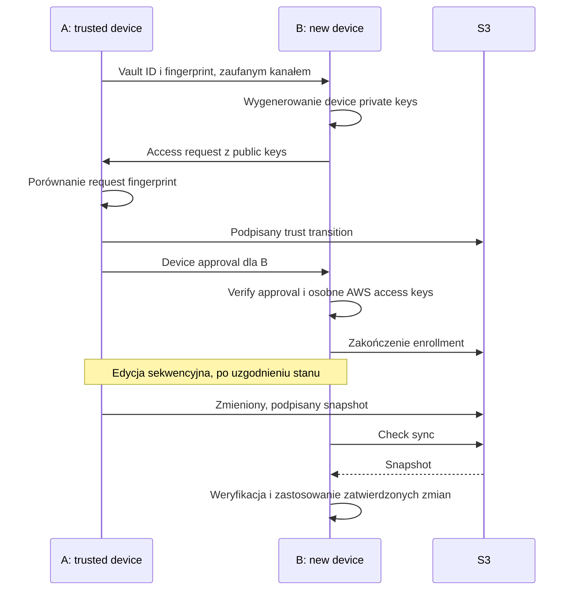

# LFSPM: opis aplikacji i scenariusze testowe

Stan na 9 września 2026 r.
Commit: `a833e93e3ee3734bea1206f7a81012e3728158e5`, PR #106.

## 1. Opis aplikacji

LFSPM jest rozszerzeniem przeglądarki z lokalnym przechowywaniem danych i synchronizacją zaszyfrowanych snapshots przez S3 użytkownika. Projekt nie korzysta z własnego backendu.

Model zakłada sekwencyjną edycję na urządzeniach; nie obsługuje automatycznego scalania równoczesnych zmian offline.

## 2. Uruchomienie

Paczka zawiera buildy dla Chrome 120+ i Firefox 140+. Do testu wielourządzeniowego wystarczą dwie instalacje w oddzielnych przeglądarkach na jednym komputerze. Recenzent tworzy własny `vault`; paczka nie zawiera danych ani credentials.

| Środowisko | Instalacja po rozpakowaniu ZIP                                                                 |
| ---------- | ---------------------------------------------------------------------------------------------- |
| Chrome     | `chrome://extensions` → tryb dewelopera → **Load unpacked** → `chrome/`.                       |
| Firefox    | `about:debugging#/runtime/this-firefox` → **Load Temporary Add-on** → `firefox/manifest.json`. |

Build Firefox jest niepodpisany; instalacja tymczasowa wygasa po restarcie. Pełny test wymaga konta AWS z uprawnieniami do utworzenia zasobów S3 i IAM.

## 3. Przebieg testu

A: instalacja początkowa. B: instalacja dołączana.

### Vault

**New vault** → ukończenie kreatora i zapis `recovery words` → dodanie oraz edycja `entry`.

### S3 sync

**Options → Sync → Use template** prowadzi przez konfigurację AWS. `Access keys` należy utworzyć osobno dla wskazanego użytkownika IAM. **Test access** potwierdza wyłącznie odczyt; **Enable sync** zapisuje snapshot pod `<prefix>vault.enc`.

### Device enrollment

1. A: **Devices → Add a device**. Przekazanie `Vault ID` i `Vault fingerprint` do B.
2. B: **Existing vault → Create access request**. Przekazanie żądania do A.
3. A: **Approve a device → Review access request**. Porównanie `request fingerprint` z B → **Approve device**. Przekazanie zgody do B.
4. B: **Verify approval → Connect vault** w tym samym profilu, który utworzył żądanie.

AWS `access keys` trzeba podać w B osobno. Jeśli A zgłasza **Upload pending**, przed połączeniem B należy zakończyć **Retry upload**.

### Sync A → B → A

Po enrollment uzgodnienie stanu A. Zmiana `entry` w A → zakończenie upload → **Check sync** w B → zatwierdzenie zmian. Następnie ta sama próba w przeciwnym kierunku.

### Recovery

**Forgot password? → Set new password**, następnie zapis nowych `recovery words`. Wymagane są pasujące lokalne rekordy; same słowa i snapshot z S3 nie odtwarzają usuniętej instalacji.

### Device revocation, na końcu testu

W A: **Devices → Review revocation** dla B. Nowe AWS `access keys` należy wpisać bezpośrednio w formularzu, bez wcześniejszej wymiany w Sync. **Revoke device** → zakończenie upload → usunięcie w IAM wszystkich starych kluczy dostępnych B → **Verify old keys are revoked**.

Dezaktywacja klucza nie wystarcza do potwierdzenia usunięcia. Pozostałe instalacje wymagają aktualnych credentials. Revocation nie odbiera dostępu do wcześniej zachowanych kopii danych.

## 4. Próby negatywne

| Warunek                                                  | Oczekiwane zachowanie                                                                                                              |
| -------------------------------------------------------- | ---------------------------------------------------------------------------------------------------------------------------------- |
| Brak uprawnień przeglądarki lub błędne AWS `access keys` | Brak potwierdzenia sync; możliwość poprawienia konfiguracji.                                                                       |
| Obcy obiekt pod `<prefix>vault.enc`                      | Brak nadpisania; możliwość wskazania wolnego `prefix` objętego uprawnieniami IAM.                                                  |
| Zmiana zdalnego stanu przed lokalnym zapisem             | Wymuszenie sync/review zamiast nadpisania nowszej wersji.                                                                          |
| Przerwanie połączenia podczas upload                     | Zachowanie stanu oczekującego i uzgodnienie wyniku przez **Retry upload**. Utrata odpowiedzi nie jest dowodem niewykonania zapisu. |
| Device approval w innym profilu lub z błędnym hasłem B   | Odrzucenie enrollment.                                                                                                             |

## 5. Architektura i protokół

Strzałki ciągłe oznaczają zależności kodu, przerywane dostęp do usług.

### Key hierarchy

Key wrapping: ECDH P-256, HKDF-SHA-256, AES-256-GCM. Podpisy: Ed25519. AWS `access keys` zapewniają dostęp do S3, niezależnie od kluczy szyfrujących treść.

### Device enrollment i sync

