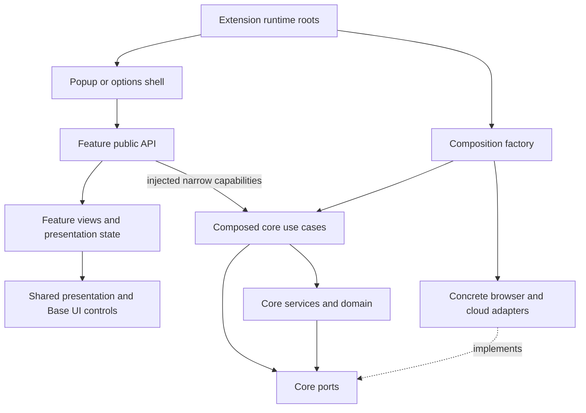

# Frontend architecture for popup and options

Status: the options application now connects setup, entries, organization,
password tools, devices, sync and vault settings to composed capabilities. The
popup provides quick entry editing, password tools and device settings, and hands
longer setup/recovery workflows to Options. Browser-login capture and Fill remain
presentation-only until their runtime capabilities are supplied. See the
[full application coverage map](../plans/full-application-ui.md). The
[core architecture](../standards/core-architecture.md) and
[React/UI standards](../standards/react-and-ui.md) remain authoritative.

## Recommendation

Organize frontend work by product feature. Each slice owns its views, presentation
state, use-case invocation and tests. Popup and options are thin composition shells
that reuse these features. This adapts feature-sliced organization to the existing
hexagonal application; it does not move core workflows into React or duplicate
domain entities in a second frontend domain model.

Feature-Sliced Design supports cohesive slices and explicit public APIs. React's
state guidance supports placing shared view state with its nearest owner. These
are influences, not a claim of full FSD conformance or a requirement to reproduce
its entire layer hierarchy. [R08](./references.md#r08-frontend-organization).

## Layout and implementation boundary

```text
apps/extension/src/
  extension/
    composition/                 # Existing use-case/adapters construction
    options/options.tsx          # Options runtime root; inject capabilities
    popup/popup.tsx              # Popup runtime root; inject capabilities
    background/                  # Existing alarms; other handlers only as needed
  ui/
    entrypoints/
      options/options.view.tsx   # Options navigation and feature assembly
      popup/popup.view.tsx       # Compact shell and feature assembly
    features/
      vault-setup/
        index.ts                 # Explicit public exports
        setup.view.tsx
        setup.controller.ts      # Or hook: calls injected use cases
        setup-state.type.ts      # Visible states only
        setup-state.ts           # Pure presentation transitions
        setup.test.tsx
      vault-access/
      entries/
      folders/
      tags/
      organization/              # Tags/Folders page composition only
      password-tools/
      sync/
      devices/
      recovery/
      settings/
      theme/                     # Existing feature retained
    components/
      primitives/                # shadcn/Base UI controls
      forms/                     # Shared password/help presentation
      feedback/                  # Shared status and confirmation presentation
      layout/                    # Shared content/help slots
    lib/                         # Small UI-only helpers, including cn
    styles/                      # Exact preset tokens and local fonts
```

Names below existing directories are proposals. Do not create empty scaffolding
for all future features. Keep a small slice flat; add internal subdirectories only
when they improve navigation. Colocate tests with the feature or control they verify.

## Dependency direction



Proposed feature boundaries:

- A shell imports a slice's explicit public exports, not its internal files.
- Peer features do not reach into one another. The shell composes them through
  callbacks, or shared presentation is extracted into `ui/components` when reused.
- Feature controllers receive only needed capabilities. Setup needs initialization
  and password-strength checking, plus session/navigation integration. It should
  not receive arbitrary repository access or a service locator with every operation.
- The bundled organization library is a separate local IndexedDB reference adapter.
  Setup and entry editing receive a narrow read capability. Vault folders, tag
  groups and tags remain encrypted vault data and change only through core use cases.
- `organization/` composes the Tags and Folders management tabs. Folder and tag
  controls stay in their owning slices; entry editing consumes their public controls.
- Shared controls render props and emit events. They do not access vault state,
  construct adapters, invoke cryptography or schedule security timers.
- Core owns strength policy, lifecycle transitions, recovery, persistence, trust,
  sync and clipboard ownership. Presentation transitions such as showing the next
  form belong to the feature.
- Public core command/result types can be imported through supported package
  exports. UI-specific error copy maps known errors without exposing raw secrets.

Promote any newly accepted import-enforcement rules into `docs/standards` with
implementation. This proposal does not silently change the current standards.

## Components, feature widgets and page compositions

“Component” names a React implementation unit. It does not mean every unit belongs
in the shared UI kit. Keep substantial domain presentations such as EntryTable,
RecoveryVerification and SyncReview in their owning feature slice. Their public
APIs let the gallery and future page shells compose them without peer imports.
Use shared presentation only when it has a stable contract across features.

The current [ownership inventory](./review-inventory.md) maps every catalog ID to
its actual source. LocalRecoveryForm takes a vault-selector slot; the entrypoint
supplies VaultPicker from vault-access. Recovery does not import that peer slice.
P28 navigation belongs to entrypoint composition. Secret data never enters route IDs.

A future reused cross-feature block can become `ui/widgets/<name>` when actual
popup/options composition requires it. Keep a one-page composition inside the
page. Canonical [FSD widgets](https://feature-sliced.design/docs/reference/layers#widgets)
are substantial independent blocks; its [public API guidance](https://feature-sliced.design/docs/reference/public-api)
supports explicit slice exports. Rechecked 2026-09-05. Our folder layout remains
an adaptation of these rules, not a claim of canonical FSD conformance.

## Runtime ownership across browser contexts

Website icons follow the [favicon implementation and safety review](./favicon-review.md#current-implementation).
The entries slice owns `SiteIcon`; shared Avatar remains presentation-only.
Production entry views use initials by default. The optional Chromium setting
uses `extension/browser/site-icons.ts` for permission, device-local preference
and origin-only lookup. Popup and Options compose stable capability instances,
while `SiteIconsProvider` observes browser storage and permission events. Firefox
keeps initials. The gallery supplies bundled same-origin fixtures for review.
No core favicon port, per-row use case or plaintext icon index is introduced.
Native permission-dialog, aged-cache and Firefox runtime checks remain open in
the linked verification record.

Popup, options and the service worker are separate JavaScript contexts. A module
singleton or React provider in one does not become a shared object in another.
The existing factory says to construct once per trusted application context;
its adapters already coordinate through storage and Web Locks.

The extension roots use the supported composition and pass narrow capabilities
to the UI. They construct capability objects outside React render state changes so
Strict Mode does not recreate the application graph. Do not add a generic message
bus or a second backend layer merely to make slices possible.

If an operation needs a service-worker message boundary, define a narrow typed
contract and validate the sender and payload. Do not expose a generic
"execute any use case" dispatcher to content scripts or external pages. Chrome's
guidance treats content-script input as untrusted. [R06](./references.md#r06-chrome-extension-boundaries).

Both extension pages use the manifest's extension-page CSP. This makes options a
reasonable home for the full UI, not a blanket security certification. A longer-lived
tab requires explicit lock/invalidation handling. Bundled help, fonts and assets
avoid sending setup data to external services.

## State ownership

| State                                                                  | Owner and lifetime                                                                                                                                                |
| ---------------------------------------------------------------------- | ----------------------------------------------------------------------------------------------------------------------------------------------------------------- |
| Input values, reveal toggles, selected step, validation copy           | Local feature state; reset when the operation/session no longer owns it.                                                                                          |
| Master password, confirmation, recovery words, typed challenge answers | Transient, narrowly scoped memory; not URLs, logs, persistent stores or general devtools state. Clear references when finished or locked; erasure is best effort. |
| Authoritative locked/unlocked state                                    | Core session mechanisms, not a React boolean.                                                                                                                     |
| Entry list/detail display                                              | Password-free read results scoped to vault/session; invalidate after relevant changes and locking.                                                                |
| Theme override                                                         | Existing UI preference mechanism, with no crypto meaning.                                                                                                         |
| Lock duration preference                                               | Device-local application capability; security-relevant, not an ad hoc localStorage hook.                                                                          |
| Recovery-backup completion/resume                                      | Explicit application contract; no plaintext persistence workaround.                                                                                               |

React Context can share view state within one mounted application. It cannot
synchronize popup and options. Define non-secret invalidation signals and re-read
authoritative status after focus, relevant mutations and lock events. Effects need
cleanup. Reject stale results from a prior vault/session or unmounted feature;
unmounting a page is not proof that an in-flight core operation was cancelled.

Use local state/reducers and narrow providers initially. Zustand is planned in
the repository, not adopted. A broad global vault store is not a prerequisite.

## Navigation and popup behavior

Use a single route vocabulary with non-secret identifiers. Options can own full
navigation; popup exposes only quick routes and explicit handoff actions. No
password, phrase, transfer secret or serialized draft belongs in route state that
is written to the URL. Opening the default page uses
`chrome.runtime.openOptionsPage()`. Quick routes use allowlisted, non-secret
hashes, focus an existing Options tab when present and update its current
destination without persisting a form draft. Chrome documents the open-options API in
[R06](./references.md#r06-chrome-extension-boundaries).

Both pages use the same EntryForm and field components where useful. Use separate
layout compositions when space differs; avoid one giant component with numerous
`isPopup` branches. Closing popup can discard local drafts, so make options editing
easy to reach. Do not promise unload confirmation or reliable async work on close.

## Implementation and validation sequence

The library, gallery and application shell integration are implemented. Setup
injects its composed capabilities for creation, existing-vault enrollment,
recovery saving/verification, continuation, lock/unlock and local lock settings.
It follows the active vault; multiple locked vaults require an explicit selection,
retained across lock/unlock in this page.

1. Keep every component and variant reviewable as enrollment and entry screens grow.
2. Resolve the remaining [setup contracts](./vault-setup.md#implementation-gaps)
   for complete disaster recovery at its implementation milestone. Enrollment now uses a local protected request, trusted-device fingerprint comparison, approval import and recovery verification.
3. Keep entry and sync features connected through narrow capabilities, reusing current
   aliases, `cn`, ThemeProvider and composition.
4. Verify shared features in both shells without adapter imports or duplicated core behavior.
5. Retain regression checks for cross-context locking, stale async completion,
   popup closure, already-open options, double submission and setup interruption.

Test presentation transitions with synthetic data, integration with real composed
use cases where practical, and the extension runtime in Chrome for cross-context
behavior. A standalone Vite page cannot prove extension lifecycle correctness.
Use the repository build/lint/type-check/test commands and managed servers when
needed. No new state, routing, or form package is assumed by this architecture.

## Third-party state and table decisions

See the [review inventory](./review-inventory.md#library-decisions-after-verification)
and [TanStack verification](./tanstack-verification.md). Table 9.2.4 is used only
with copied display fields. The inspected Form 1.33.5 is excluded unchanged from
secret forms. Query, Virtual and tRPC remain outside this library build.
