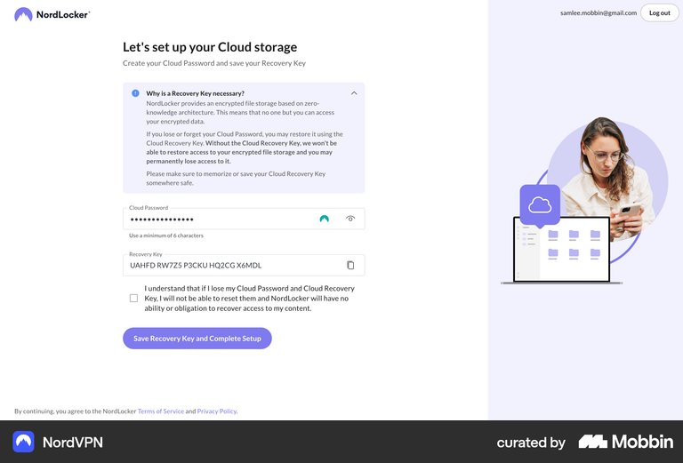
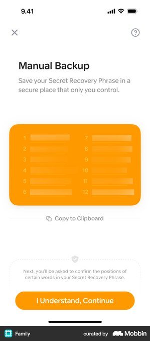
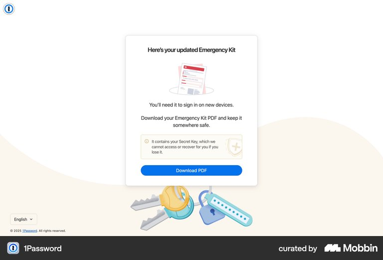
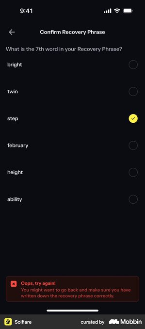
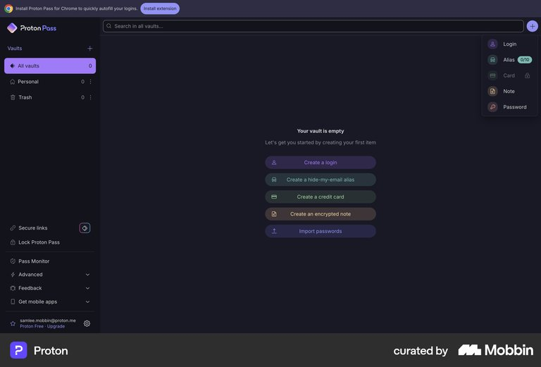

# Mobbin reference board

Five screens were fetched through the authenticated Mobbin MCP and visually
inspected on 2026-09-05. Files are attached locally so documentation does not
depend on expiring image URLs. Canonical screen links retain attribution and
access to the originals. The [asset manifest](./assets/mobbin/manifest.json)
records source IDs, retrieval date, byte counts and SHA-256 digests.

These are third-party design references, not our implementation, a security
endorsement, or assets for inclusion in the extension. Retain their attribution.
Screens depict different products and dates; they do not form a captured single
user journey. The [setup flow](./vault-setup.md) is our synthesis.

## M01: setup guidance

[NordLocker setup, catalogued under NordVPN](https://mobbin.com/screens/2fcead60-c0ec-484f-84ff-da6d1416fb3b),
web. Also part of [the setup flow](https://mobbin.com/flows/90987830-cced-4114-8f7a-6bc36c984a39).

Observed: explanatory recovery content above the form, password visibility control,
copy action, acknowledgment and a clear completion button. Use for S1–S3 information
placement. Do not copy its six-character guidance, cloud wording, key format or
acknowledgment-only completion. Our core has different policy and 24 recovery words.

## M02: recovery display

[Family manual backup](https://mobbin.com/screens/17721de6-0685-45e7-b39e-6418045ba876), iOS.

Observed: a numbered two-column phrase, copy affordance, a short storage instruction
and notice that word positions will be checked next. Use the explanatory sequence
for S3. Adapt to 24 words and desktop options layout. The screenshot's blurred
appearance is not evidence of secure concealment; our hidden state should omit
the secret text from the rendered content.

## M03: recovery download

[1Password updated Emergency Kit](https://mobbin.com/screens/524bee49-867b-455e-ba18-ba538cb1e7da), web.

Observed: a dedicated PDF download action and concise explanation of the kit's
importance. It says **updated** Emergency Kit, so it is a download interaction
reference, not proof of the initial signup sequence. Use for S3 export presentation.
Do not reuse its new-device sign-in promise: our word sheet cannot restore a lost
installation by itself. Exports and local-access recovery are different concepts.

## M04: word verification and error recovery

[Solflare recovery-word confirmation](https://mobbin.com/screens/bec2a250-1e6c-45eb-a390-c31f8182ff86), iOS.

Observed: one requested position, answer choices, back navigation and actionable
error feedback. Use the error/review pattern for S4. Our design asks for three
random distinct positions using text fields. The screenshot does not establish
random selection, three-word verification, or security effectiveness.

## M05: empty vault

[Proton Pass empty vault](https://mobbin.com/screens/652c5aa3-fb65-44a9-87b0-5247bdf9765e), web.

Observed: the user is inside the application, with an empty-state explanation and
clear creation actions. Use for S5 and the full options shell. Our first action is
adding a password entry, with optional sync afterward. Do not add its card, alias,
note or import capabilities merely because they appear in this reference.

## Selection checks

Search queries sometimes returned other apps or an unrelated stage. Captions above
follow the returned image and canonical metadata, not the query text. A 1Password
"Create a new vault" screen with team categories was rejected as an empty-vault
reference. No exact visual match was found for our device-local timeout settings
or the complete three-word input screen; those need our own design and validation.
