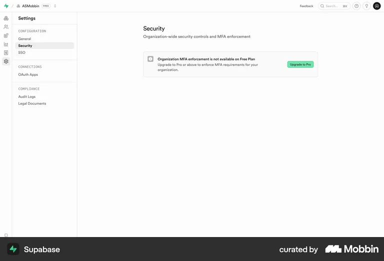
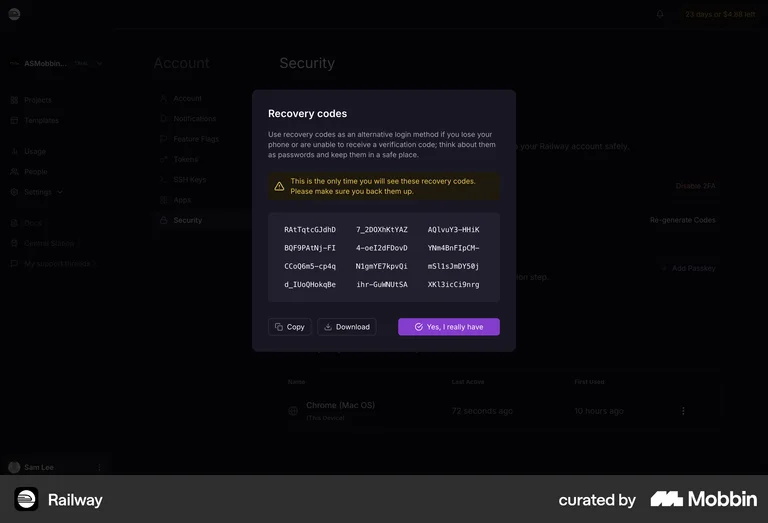

# Information and warning panels

Reviewed in Mobbin on September 6, 2026. These references inform presentation,
not AWS instructions or security policy.

- [Supabase security notice](https://mobbin.com/screens/20608d29-1076-492c-bcff-38bbf79cd62a): icon beside a clear title and supporting text. Keep the grouping; use more readable body sizing for extended instructions.
- [Railway recovery warning](https://mobbin.com/screens/12245d2d-256d-4d89-8e22-f6ec64c89fee): amber background and triangle icon distinguish a safety warning in a dark interface. Keep the warning next to the action it concerns.

The local images are reference material, excluded from the extension build.

`GuidancePanel` is a shared presentation component, family P29. Its `info` and
`warning` variants use blue and amber semantic tokens with separate light/dark
values. Warning also uses a stronger leading border. An accessible severity
label and distinct icons ensure color is not the sole distinction.

The body accepts paragraphs, lists and grouped facts. Optional `links` and
`attachments` slots separate reference links and captioned screenshots from
prose. Supply meaningful image alt text and captions; gallery screenshots open
at full size. Product screenshots must use bundled, sanitized assets, not
remote account pages or images containing credentials. Rich content comes from
trusted application code, never raw provider HTML.

These are persistent notes. Runtime failures still use `ActionFeedback`; a
warning panel alone does not trigger an assertive live announcement. S3 status
changes use the parent's polite status region.

P29 includes short/long text, grouped information, links and an attached image,
plus a named variant chooser. The image shows the actual extension guide with
gallery values and is bundled only with the gallery.
