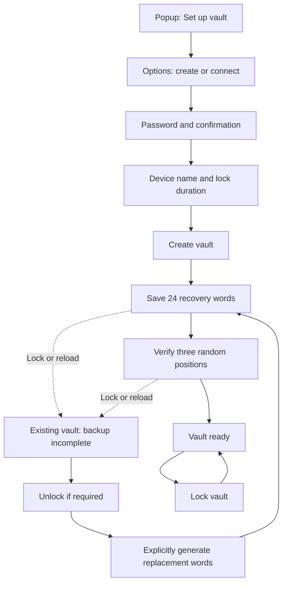

# First-vault setup

The Options page now runs password creation, device settings, vault initialization,
recovery saving, a three-word verification, and the completed-vault view. The popup
opens Options. Entry management opens after verification. Existing-vault enrollment remains a separate flow.

## Flow

The two large selectable setup cards remain the starting point. Their requirements
belong to each option. Existing-vault connection uses device enrollment, not a
recovery-phrase shortcut.

Password strength remains hidden while the field is empty. Confirmation and core
strength policy gate Continue. Password drafts survive Back from device settings,
but are cleared when creation starts or the user leaves setup. Core rechecks the
password policy during initialization. A failed creation reconciles local state
before another attempt. Creation is serialized across Options tabs with a Web Lock
and rechecks that no local vault exists inside that lock.

## Device settings

The device name defaults to "This browser" without fingerprinting. Initialization
uses the existing core device profile. Lock duration uses the core choices in
milliseconds: 1, 5, 10, 30, or 60 minutes, with a 10-minute default.

The duration is stored per local vault in this browser. It is a fixed delay from
unlock, including active use. After setup, Settings can change this setting;
changes take effect on the next unlock. Setup does not suspend the lock alarm.
Settings now edits the device-local display name and lock duration. This does not rename the shared trusted-device profile.

## Recovery saving and verification

The vault already exists when recovery words are returned. Recovery words are held
only in the Options document's memory and are absent from the DOM until explicitly
revealed. Verification removes the displayed phrase and asks for three distinct
positions selected with WebCrypto randomness and rejection sampling. Positions stay
fixed through retries. The application controller checks the answers against its
current phrase and checks session state before recording completion.

Available saving methods:

| Method              | Behavior and limitation                                                                                                                                                                                                                                 |
| ------------------- | ------------------------------------------------------------------------------------------------------------------------------------------------------------------------------------------------------------------------------------------------------- |
| Write down          | Reveal 24 numbered words and preserve their order.                                                                                                                                                                                                      |
| Text download       | A locally generated unencrypted record with identity and recovery guidance.                                                                                                                                                                             |
| Print / save as PDF | The browser print dialog receives only the recovery record. Use a trusted printer or its Save as PDF destination.                                                                                                                                       |
| Copy                | The core recovery-copy use case validates the phrase against current recovery material and reuses clipboard ownership, alarms, and cleanup. The active value is eligible for clearing after 30 seconds; clipboard history and synced copies can remain. |

Copying, opening a download, or requesting printing does not mark backup complete.
The user acknowledges saving all words and then verifies three positions. This is
a spot-check, not proof that the entire backup is correct.

The UI states the recovery limit explicitly: words need the matching local recovery
data. A word sheet cannot restore deleted browser data or a lost device. Recovery
artifacts, full disaster-recovery export/import, and encrypted export formats are
separate features. No recovery export contains the master password or S3 credentials.

## Interrupted setup

No original phrase is persisted for retrieval. Reloading or closing the document
loses it. Lock invalidation clears the controller's phrase and the UI's displayed
words and challenge answers. Storage events and a periodic session check handle
background locking; each export and verification also checks current access.

An existing vault without a completed setup receipt offers password unlock when
required, followed by an explicit **Generate replacement words** action. The new
`ReplaceRecoveryWordsUseCase` uses the active session's device keys, verifies device
identity, and atomically replaces the recovery wrapper and access-record generation.
It preserves password access and uses existing core crypto and repository contracts.
It creates no schema version or additional encrypted-secret store.

Old words stop matching the current local recovery wrapper. Retained older backups
can still work with their original words while that device identity remains trusted.
The replacement screen explains this limitation. Replacement writes an incomplete
receipt before changing recovery material, so failure or closure continues to show
incomplete setup. Competing replacement attempts invalidate older document receipts.

Only non-secret preferences, a random attempt receipt, and the completion flag are
stored in Chrome local storage. Completion is presentation progress and never grants
vault access. The core session remains authoritative for locking and unlocking.

## Architecture and gallery

`OptionsView` assembles feature-owned setup components. `useVaultSetup` owns React
presentation state and stale-result handling. The Options composition root supplies
capabilities that orchestrate public core use cases and browser-only export and
preference operations. Core cryptography and device-access mutations remain in core.
`SecretClipboardCopyService` owns shared copy scheduling and cleanup behavior for
entry passwords and recovery words.

S02 in the gallery uses the real components with gallery-only fixtures. It includes
recovery, verification, error, pending, export-failure, locked, incomplete, and
completed states. The interactive creation path also runs with injected fixtures.
The production Vite inputs exclude the gallery.

## References

The accepted visual references remain [M01–M05 in the Mobbin index](./mobbin.md):
NordLocker for setup guidance, Family for numbered words, 1Password for recovery
saving, Solflare for verification, and Proton Pass for later entry management.

Implementation constraints follow the [core security model](../core/security-model.md#local-access-and-recovery),
[Chrome storage documentation](https://developer.chrome.com/docs/extensions/reference/api/storage),
and the [print API behavior](https://developer.mozilla.org/en-US/docs/Web/API/Window/print).
The browser references were checked on 2026-09-06.

## Validation

Automated checks cover competing setup tabs, failed creation after persistence,
three distinct challenge positions, wrong answers, stale callbacks, lock invalidation,
password access after recovery replacement, rejection of old recovery words, and
clipboard cleanup. Browser validation loads the production extension and runs
creation, a text download, recovery verification, reload/continuation, replacement,
locking, unlocking, and persisted completion with disposable test data.

Validation on 2026-09-06: 501 extension tests and 743 core tests passed, together
with type checks, extension lint, production builds, and 64 gallery checks across
light/dark themes and 320/1280px layouts. Chrome also confirmed actual clipboard
contents, locking from another Options tab, and automatic locking during recovery
with secret DOM removed. The unpacked extension uses Figtree at a 16px body size.
Native printer hardware and operating-system clipboard-history deletion were not
tested. Browser-result dumps remain outside tracked source.

## Forgotten password on this browser

Open Options, select the existing vault and choose **Forgot password?**. Enter the
24 recovery words saved for this browser, then a strong new password twice. The
form accepts whitespace-separated words and numbered lists copied from the PDF,
including pasted line breaks and uppercase input. Numbered lists must contain
positions 1–24 in order, without gaps or duplicates. A complete valid paste becomes
a compact phrase; invalid input stays unchanged for correction. The core validates the BIP39 phrase and the matching
local recovery records before changing access. The extension does not send the
words or password to S3.

Successful recovery changes this browser's password and generates replacement
recovery words. Save all 24 new words and verify three random positions before
returning to Entries. The device identity, vault entries and encrypted S3
credentials stay intact. Other enrolled devices keep their own passwords.
The previous words stop matching this browser's current recovery record; retained
older copies of the record can still work with their original words.

Keep the extension installed and retain its browser data. Words alone cannot
restore a lost device or deleted recovery records. S3 contains the encrypted vault,
not a replacement for the matching local recovery data.

The composition records unfinished recovery before calling the existing
`RecoverDeviceAccessUseCase`. Rejected recovery restores the previous completion
receipt. If the password change succeeds but the page closes or session activation
fails, unlock with the new password and choose **Generate replacement words** to
finish. No plaintext password or mnemonic is written to extension preferences.
Cancelling, switching vaults, leaving the page or session invalidation clears the
form. An ordinary window-focus refresh preserves a draft for pasting from a saved
record. Late results from an invalidated form cannot redisplay recovery words.

Gallery: **Recover access** covers idle, pending and error; **Save recovery words**
and **Verify recovery words** include an After password recovery variant. F06
contains the actual form, including missing local data and password assessment
states. The unpacked-browser regression in `verification/sync-options.verify.cjs`
checks wrong words, replacement-word verification, preserved entries and working
S3 credentials, and rejection of the old password after recovery.

## Existing-vault enrollment and security settings

The Existing vault card opens the connected enrollment flow. On a trusted device,
Devices shows the vault ID and genesis fingerprint. The new browser uses that
identity to create a password-protected local request. Transfer the request file
or text, compare the complete request fingerprint on both devices, then approve.
Import the approval on the requesting browser using its original request password.
An already-created request can resume by importing its approval after reopening
Options. Choose Verify approval to check its signature, trust anchor and match
with the password-protected request. Only then show the bucket, region and prefix
from its decrypted vault as read-only values. Ask for this browser's access keys.
Changing the approval or password clears verification and the key draft. Connect
vault requests browser storage permission from that click and verifies the approval
again before enrollment. Reading the approval neither creates a vault nor contacts S3.

Successful enrollment opens the existing save-and-verify recovery flow. An
incomplete receipt is staged before activation, so an interruption cannot treat
the new recovery words as already verified. A pending upload remains visible.
Settings also provides local password changes, recovery-word replacement and
explicitly confirmed local vault removal. See the
[coverage and verification plan](../plans/full-application-ui.md).

## Enrollment requires sync

Devices shows “Set up sync” for a vault without S3 configuration instead of
Add/Approve device controls. The connection form always requires S3 credentials
for the existing vault's bucket, region and prefix; there is no sync opt-out.
The core rejects local-only authorization and local-only approval snapshots.

Returning to the Options window performs an in-place status check. Keep the
current enrollment step, imported approval and unsaved credentials in memory
through that check. Do not replace the form with a loading screen. Real session
invalidation still clears secret drafts; no credentials are persisted for focus
refreshes.
