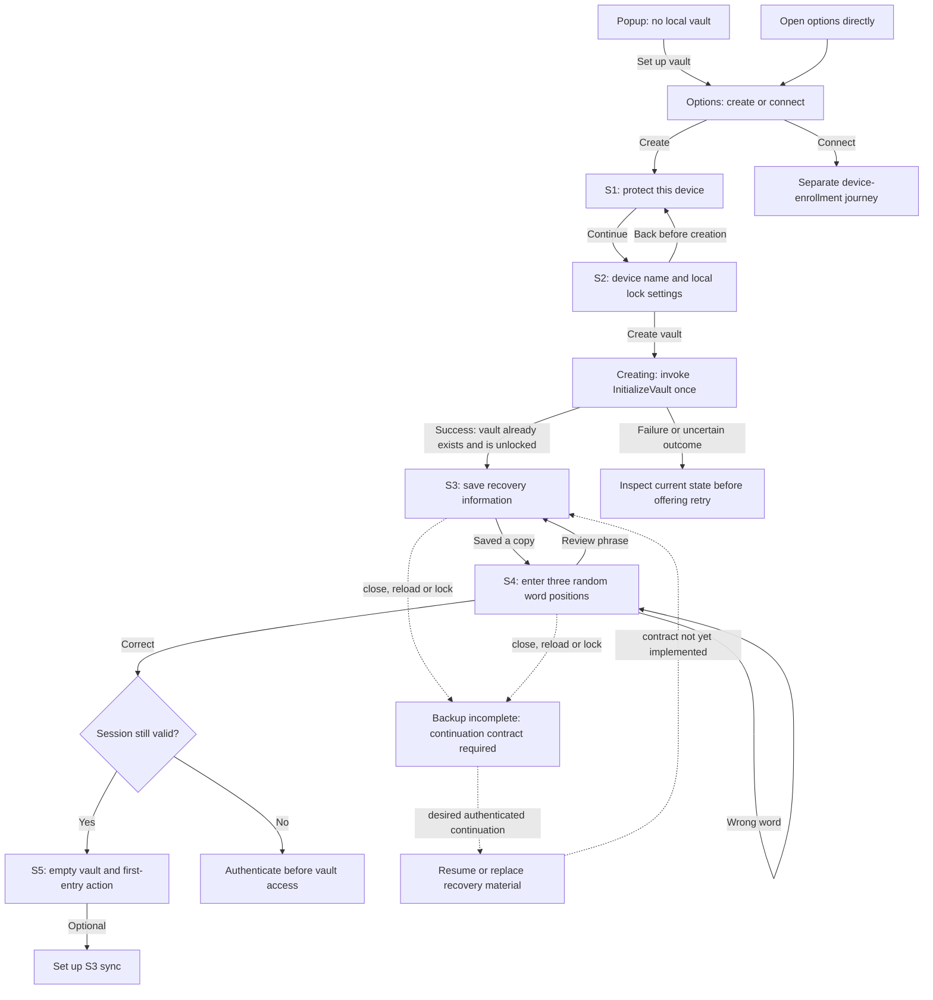

# First-vault setup flow

Status: popup handoff, S0, S1 and the device-settings presentation are implemented
as an explicit preview. The full live sequence below remains proposed, based on
the [accepted decisions](./README.md#decision-register).
Core facts were checked on 2026-09-05. The recovery-continuation and preference
contracts below are implementation gaps, not existing behavior.

Screen assembly follows completion and review of the full
[component library](./component-specification.md). This flow informs component
requirements; it is not the first implementation batch.

## Entry and screen sequence

Dashed paths describe intended behavior that needs application support. They are
not permission to retain plaintext words or bypass locking. Direct options access
also checks local-vault/session status; it does not always show first launch to an
existing user. The creation path never silently enrolls a new device, and enrollment
does not recreate the original vault.

### S0: choose setup

Popup offers **Set up vault**. Options presents two large selectable cards,
**New vault** and **Existing vault**, with radio indicators and one **Continue**
action. New vault is initially selected; selecting a card does not navigate.
Each card lists its own requirements under **What do I need?** New vault needs a
strong device password and private storage for recovery words. Existing vault
needs an unlocked trusted device for approval, a way to transfer the request and
approval, and a strong password for this device. S3 configuration is optional
later. Do not add heading subtitles.

Existing-vault connection uses the current request/approval/response enrollment
workflows. Its detailed screen design is a later feature, not an invented
"enter the recovery phrase on any device" shortcut.

### S1: protect this device

Show master password, confirmation and independent reveal controls. Hide the entire
strength block while the password is empty, without placeholder text or reserved
space. Show it after typing and hide it again when cleared. Present named ratings,
with Strong corresponding to core score 4.
Keep recovery requirements in the recovery step.

Show confirmation errors after blur or submission, distinguish missing input from
a mismatch, and announce a match when both values agree. Show Caps Lock only when
detected in the focused field. Keep one Back action and Continue on the right.

Continue checks confirmation and requires a completed, accepted assessment. A
pending or failed assessment must not be reported as a weak password; offer retry
for failure. The creation use case remains authoritative and rechecks policy.
Confirmation catches typing mistakes; it does not prove memorization. Preserve
input when returning from device settings without persisting it in browser
storage. Back from the password step returns to setup choices and clears input.

### S2: device settings and creation

Suggest an editable device name without invasive fingerprinting. If basic platform
information is unavailable, use a neutral suggestion such as "This browser".
Show the 10-minute default and allowed choices: 1, 5, 10, 30 and 60 minutes.
Explain that changes apply to this device and remain editable later.

The exact timer wording is pending. Current behavior is an absolute delay after
unlock, not inactivity. Do not label it "after inactivity" until that behavior is
implemented. Decide whether the local preference applies to all vaults in this
installation or per local vault, and how changes affect an already-running timer.

**Create vault** invokes initialization once. Disable duplicate submission, keep
an accessible busy status, and do not show a fake percentage. The master password
is cleared from the form after ownership transfers or the operation ends. Core
generates the vault name, so this screen does not ask for a custom name.

### S3: save recovery information

The vault now exists. Present its generated name and this device's identity, an
explicit reveal action, and 24 numbered words with stable reading order. Keep the
words out of the DOM while concealed rather than relying on visual blur alone.

Use a visible explanation followed by optional detail:

> These words can recover access on this device if you forget its master password.
> Recovery also needs the saved recovery data. The words alone cannot restore a
> lost device or deleted browser data.

> Keep this copy private. Someone with these words and the matching recovery data
> could recover your device's access.

Offer the methods below, each with a short consequence description. A PDF, TXT
file and copied phrase all expose plaintext unless a separate, reviewed encryption
format is explicitly used. No format is labeled "secure" merely because it is PDF.

| Method             | Proposed experience                                                                    | Security and failure handling                                                                                                        |
| ------------------ | -------------------------------------------------------------------------------------- | ------------------------------------------------------------------------------------------------------------------------------------ |
| PDF recovery guide | Numbered words, vault/device identification, instructions, format description and date | Generated locally. Plaintext warning. Exclude the master password and provider credentials.                                          |
| TXT download       | Portable text with words and concise recovery instructions                             | Explicit **Unencrypted text file** label; advise protected storage.                                                                  |
| Print              | Dedicated readable layout with all words and guidance                                  | Use a trusted printer; paper and print jobs can expose the words. Printing is not proof that a usable copy was saved.                |
| Copy               | Deliberate action, success/failure feedback, clipboard-history explanation             | Use coordinated secret-copy handling. Clearing the active clipboard cannot guarantee deletion of clipboard history or synced copies. |
| Write down         | Large, numbered, selectable words                                                      | Preserve order; use the saved copy for verification.                                                                                 |

Do not automatically upload, email or send these exports to a third-party PDF
service. Explain protected/offline storage and why a copy solely inside the same
locked vault would not help regain access. Avoid automatic screenshots or sharing
links. No QR export is currently proposed because there is no corresponding
reviewed import workflow.

PDF/print is supported as an interaction reference by [1Password](./references.md#r03-recovery-downloads),
not as a transfer of its recovery model. Clipboard limitations follow
[Microsoft's documentation](./references.md#r05-clipboard-behavior).
The exact formats and browser implementation still need validation.

### S4: verify the saved copy

Display three distinct positions selected randomly from 1–24. Show their position
numbers, not the expected answers. Keep positions fixed through retries during
this attempt. Allow paste and normal keyboard interaction. Use the application's
canonical mnemonic normalization rather than inventing a second recovery parser.

Draft copy:

> Open the copy you saved and enter the requested words. You do not need to
> memorize them.

Show errors beside the relevant field and provide **Review recovery words**.
Three correct entries demonstrate a spot-check, not complete transcription or
secure storage. This is a UX safeguard, not authentication or a cryptographic
security boundary. Incorrect answers do not delete the vault or rotate keys.

Do not copy the [Solflare reference's multiple-choice interaction](./mobbin.md#m04-word-verification-and-error-recovery)
as the final design: our agreed interaction is three typed word positions.
Clear words and challenge answers when the workflow is finished or loses ownership.
JavaScript memory cleanup is best effort.

### S5: open the vault

After verification, confirm the active session and open options' empty vault.
Keep a clear **Lock vault** action. Primary action: **Add your first password**.
Secondary action: **Set up sync**, with a short explanation of what it adds.
Show accurate local/sync status without claiming the user is "fully protected".

This destination is consistent with [Bitwarden's first-login experience](./references.md#r04-vault-landing).
It is acceptable only if session checks, concealment and lock handling work. A
completed setup flag does not authorize access. If the vault locked meanwhile,
authenticate before showing protected data.

## Visual references by step

These are reference products, not LFSPM screenshots. The
[reference board](./mobbin.md) attaches the local files and documents adaptations.

| Our step    | Reference                                                            | Apply                                                                 |
| ----------- | -------------------------------------------------------------------- | --------------------------------------------------------------------- |
| S1 / S2     | [M01 NordLocker](./mobbin.md#m01-setup-guidance)                     | Explanation close to the form and a clear primary action.             |
| S3 display  | [M02 Family](./mobbin.md#m02-recovery-display)                       | Numbering and advance notice of verification; adapt 12 words to 24.   |
| S3 download | [M03 1Password](./mobbin.md#m03-recovery-download)                   | Explicit PDF action and storage guidance.                             |
| S4          | [M04 Solflare](./mobbin.md#m04-word-verification-and-error-recovery) | Error recovery and returning to review.                               |
| S5          | [M05 Proton Pass](./mobbin.md#m05-empty-vault)                       | An actionable empty vault; restrict actions to supported entry types. |

## Interruptions and errors

| Trigger                                                 | Intended behavior                                                                          | Current support                                                                              |
| ------------------------------------------------------- | ------------------------------------------------------------------------------------------ | -------------------------------------------------------------------------------------------- |
| Back before Create vault                                | Return to the previous form with transient input intact.                                   | UI work.                                                                                     |
| Double click / retry after an uncertain creation result | Prevent duplicate invocation; reconcile whether creation committed before another attempt. | Needs explicit UI/application integration design.                                            |
| Password mismatch or insufficient strength              | Inline error, retained input and focus on the relevant field.                              | Confirmation is UI; strength policy exists in core.                                          |
| Storage/crypto failure                                  | Explain the operation failed without exposing secrets or internal stack traces.            | Map known core errors; reconcile persisted state where necessary.                            |
| Copy denied / download failed / print cancelled         | Keep recovery step available and offer another method.                                     | Recovery export workflow is new; no claim that opening a save dialog means backup succeeded. |
| Wrong challenge answer                                  | Stay on the same positions; retry or review.                                               | UI work.                                                                                     |
| Lock during save or verification                        | Conceal and clear secret UI state; require authentication for continuation.                | Lock exists; recovery continuation does not.                                                 |
| Reload or close during recovery                         | Show backup-incomplete status with a supported authenticated continuation.                 | No original-phrase retrieval contract exists.                                                |
| Multiple setup pages                                    | Coordinate ownership and avoid conflicting attempts or unrelated secret delivery.          | Existing session coordination helps; setup ownership still needs design.                     |

Do not suppress the lock timer indefinitely for setup. Provide warning and an
explicit way to obtain more time if supported by the finalized session policy.
Paper backup can take longer than expected. W3C advises accommodating time limits;
it does not justify persisting secret drafts or silently extending sessions.

## Implementation gaps

1. **Recovery continuation:** choose an authenticated resume/replacement protocol
   with ownership, expiry/cleanup and crash behavior. No original-phrase retrieval
   exists. Replacement must respect the fact that old words may still work with
   retained older backups; do not promise global invalidation.
2. **Lock preferences:** persist locally through an application boundary; decide
   fixed versus inactivity timeout, setting scope and active-session changes.
   Inactivity was an assistant recommendation, not a confirmed user decision.
3. **Recovery copy/export:** define supported commands and output formats. Reuse
   clipboard ownership/cleanup internals without pretending recovery words are an
   entry password. Avoid direct UI access to adapters.
4. **Backup completion:** define where non-secret progress lives and what it means
   after lock/restart. It is never an alternative access credential.
5. **Disaster recovery:** design export/import of required encrypted artifacts if
   recovery after installation loss is adopted. A word sheet is not that feature.

These are application and product decisions. They are not resolved by choosing a
component library. See [the current recovery model](../core/security-model.md#local-access-and-recovery)
and the code evidence in [R10](./references.md#r10-repository-contracts).

## Validation of the proposed experience

Use representative new users and synthetic vault data. Ask them to create a vault,
save a copy using their preferred method, explain what it can recover, complete
the challenge, change local lock settings and add an entry. Observe wrong turns,
confusion, recovery understanding and interruption recovery. Screen references
and guidelines do not establish that this exact sequence is optimal.

Before calling setup complete, verify:

- Keyboard-only operation, clear focus after step changes, associated field
  errors, meaningful headings and status announcements.
- Light/dark contrast, zoom/reflow, readable 24-word ordering, and print output.
- No password or phrase in URLs, logs, analytics, screenshots from tests using
  real data, persistent presentation stores or third-party requests.
- Lock invalidation across popup/options, stale async results, repeated actions,
  reload/closure, and failures of each export method.
- A successful export action does not skip the three-word check, and a correct
  check does not bypass session validation.
